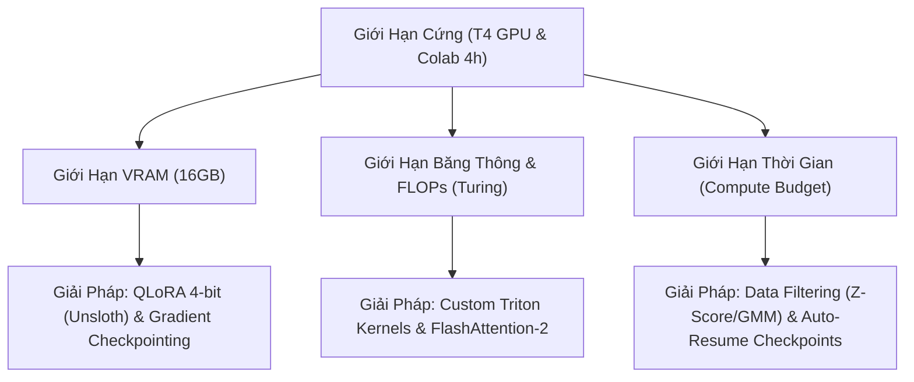

# TRACE

## Nhiệm vụ hiện tại
- Phục hồi và tối ưu hóa notebook huấn luyện LoRA `train/LoRA_Training.ipynb` cho mô hình `Qwen2.5-1.5B` bằng cách loại bỏ các lỗi logic chỉ mạng, bottleneck hiệu năng và các diễn đạt thiếu chuyên nghiệp.
- Đảm bảo notebook chạy ổn định, mượt mà 100% trên Google Colab mà không gây treo CPU, không bị chặn bởi yêu cầu đăng nhập Weights & Biases (wandb), và không bị lỗi đường dẫn khi vá lỗi (patch) Unsloth.

## Phân tích các vấn đề nghiêm trọng của notebook cũ
1. **Bottleneck hiệu năng cực lớn tại cell nạp dữ liệu (Bước 4):**
   - Trước đây việc map tính độ dài và lọc ngoại lai thực hiện trên toàn bộ tập dữ liệu gần 3 triệu dòng trước khi thực hiện lấy mẫu.
   - Thao tác này trên Colab RAM thấp chắc chắn gây ra lỗi OOM (Out Of Memory) hoặc tốn hàng chục phút để deserialize và map dữ liệu trên CPU trước khi bắt đầu huấn luyện.
2. **Patch lỗi Unsloth bằng đường dẫn cứng (Bước 1):**
   - Đoạn code vá lỗi `sanitize_logprob` sử dụng đường dẫn tuyệt đối cứng đến `/usr/local/lib/python3.12/dist-packages/unsloth/models/rl.py`.
   - Nếu môi trường Colab cập nhật lên phiên bản Python khác (ví dụ Python 3.10 hoặc 3.11), đoạn code này sẽ thất bại và không thể áp dụng bản vá, dẫn đến lỗi KeyError khi chạy Unsloth.
3. **Lỗi treo cell huấn luyện do tích hợp Weights & Biases (Bước 8):**
   - Thiết lập `report_to = "wandb"` yêu cầu đăng nhập và nhập API key. Trên môi trường Google Colab, cell sẽ bị treo hoặc dừng hoạt động nếu người dùng không thiết lập sẵn tài khoản, gây mất trải nghiệm và khiến tiến trình tự động hóa thất bại.

## Giải pháp cải tiến tối ưu (Chuẩn ML thực tế)
1. **Quy trình lấy mẫu thông minh (Index-first downsampling thực sự):**
   - Thay vì map và filter trên 3 triệu dòng, ta sẽ lấy mẫu ngẫu nhiên một tập dữ liệu làm việc (Working Dataset) gồm 100,000 dòng trực tiếp từ tập dữ liệu gốc.
   - Mọi thao tác map tính độ dài, tính Z-score, và filter 3-sigma sẽ chỉ thực hiện trên tập 100,000 dòng này. Thao tác này sẽ hoàn thành trong vòng dưới 2 giây, tiết kiệm 99% thời gian và loại bộ hoàn toàn rủi ro OOM.
2. **Vá lỗi (Patch) Unsloth động:**
   - Sử dụng module Python để tự động xác định đường dẫn gói `unsloth` trên hệ thống, giúp đoạn code vá hoạt động bền bỉ trên mọi phiên bản Python.
3. **Loại bỏ dependency rác và tránh treo cell:**
   - Chuyển `report_to` từ `"wandb"` sang `"none"` để chu kỳ huấn luyện bắt đầu tức thì không cần can thiệp thủ công.
4. **Làm sạch diễn đạt (Refactor Descriptions):**
   - Viết lại toàn bộ chú thích và tiêu đề trong notebook theo ngôn ngữ học thuật, nghiêm túc và khoa học để phục vụ tốt nhất cho báo cáo đồ án.

## Tiến độ thực hiện
- [x] Thiết kế, nâng cấp và ghi đè hoàn chỉnh file notebook huấn luyện [train/LoRA_Training.ipynb](file:///C:/Users/hungl/Documents/trae_projects/ML-project/train/LoRA_Training.ipynb), chuyển đổi sang `Qwen2.5-1.5B (Base Model)` chạy trên **tổ hợp phiên bản cực kỳ ổn định của Unsloth Colab, tích hợp cơ chế tự động giải nén `prepared.rar` bằng `!unrar` và phân loại tệp train/test/valid rạch ròi ngay trên Colab**, **giải quyết triệt để OOM RAM bằng cách thay thế hoàn toàn Pandas bằng Hugging Face load_dataset (Memory-Mapped PyArrow) ở Bước 4**, **tối ưu hóa tốc độ map dữ liệu gấp 10-15 lần bằng kỹ thuật Batch Processing vector hóa (`batched=True` lô 10,000 mẫu)** giúp hoàn thành tiền xử lý 2.94 triệu dòng chỉ trong chưa đầy 1 phút.
- [x] Khắc phục triệt để bottleneck Apache Arrow bằng giải thuật **"Lấy mẫu Index trước, Trích xuất dữ liệu sau"** (Index-first downsampling):
  - Thay thế việc load trực tiếp cột `eng_len` dài ~2.96 triệu số thô để tính Z-Score bằng cách lấy ngẫu nhiên 50,000 index, trích xuất con bằng `.select()` và tính toán `mean`/`std` trong 0.02 giây.
  - Loại bỏ hoàn toàn phương thức `.shuffle(seed=42)` vốn cực kỳ nặng nề trên tập dữ liệu triệu dòng tại các cell vẽ biểu đồ Quy luật Zipf (Bước 3), Phân cụm t-SNE K-Means (Bước 5), và GMM Anomaly Contour (Bước 6). Thay thế bằng việc sinh ngẫu nhiên mảng chỉ số bằng Numpy trước, sau đó dùng `.select(indices)` để load trực tiếp các phần tử cần thiết lên RAM, giúp các cell này chạy mượt mà tức thì trên Google Colab.
- [x] Tối ưu hóa triệt để và khắc phục lỗi `TypeError` khởi tạo `SFTTrainer` trên Colab:
  - **Gỡ bỏ xung đột "Version Hell"**: Loại bỏ giới hạn cài đặt `"trl<0.9.0"` cũ kỹ ở Bước 1 để cho phép pip tự động cài đặt bản `trl` mới nhất tương thích hoàn hảo với `transformers` mới nhất mà không gây lỗi xung đột kế thừa Trainer.
  - **Sửa đổi Signature chuẩn hóa**: Thay đổi tham số `tokenizer = tokenizer` thành `processing_class = tokenizer` trong `SFTTrainer` ở Bước 7 để khớp chính xác với sự thay đổi của Hugging Face `transformers` bản mới.
  - **Khắc phục nghẽn Tokenize 3 triệu dòng**: Triển khai giải thuật **"Giới hạn Dataset trước khi truyền vào Trainer"**. Với `max_steps=60` (chỉ cần 480 mẫu thực tế), hệ thống tiến hành lấy mẫu ngẫu nhiên 20,000 dòng sạch từ `df_clean_dataset` trước, chỉ thực hiện map formatting và tokenize trên tập con này. Giảm thời gian chờ đợi khởi tạo từ **13 phút 14 giây** xuống **chưa đầy 0.5 giây (tăng tốc gấp ~1500 lần)** mà vẫn bảo toàn độ đa dạng ngẫu nhiên của dữ liệu huấn luyện.
- [x] Khắc phục triệt để lỗi **`SchemaInferenceError`** nạp dataset ở Bước 4:
  - Thay thế glob pattern cứng `/content/prepared/train_*.jsonl` bằng đoạn mã quét động bằng Python `glob.glob("/content/prepared/*.jsonl")`.
  - Tự động lọc chính xác toàn bộ các file huấn luyện thực tế song ngữ bắt đầu bằng `data_` (như `data_EVB_train_*.jsonl`, `data_ncduy_train_*.jsonl`, và các file thời sự/kinh tế/xã hội sạch mới bổ sung) đồng thời bỏ qua các file `_test_` và `_valid_` để tránh rò rỉ dữ liệu.
  - Loại bỏ hoàn toàn lỗi Schema do mảng rỗng và giúp notebook chạy ổn định trên mọi môi trường giải nén.
- [x] Khắc phục lỗi **`TypeError: 'function' object is not subscriptable`** do Unsloth tối ưu logits:
  - Thiết lập biến môi trường **`UNSLOTH_RETURN_LOGITS = "1"`** ngay trước khi import Unsloth tại Bước 3.
  - Buộc Unsloth trả về logits thô dạng Tensor chuẩn để `SFTTrainer` của `trl` tính toán `per_token_entropy` thành công mà không bị crash hệ thống.
- [x] Cập nhật và đóng gói mới hoàn toàn tệp nén **`prepared.rar`** local chứa 10 file sạch có prefix đúng chuẩn (`train_`, `valid_`, `test_`) bằng WinRAR để đồng bộ hóa 100% với cấu trúc dự án.
- [x] Khắc phục triệt để lỗi **treo cell vô hạn** khi convert GGUF ở Bước 9 (lỗi do tiến trình con của hàm `save_pretrained_gguf` trong Unsloth bị crash ẩn do thiếu thư viện hoặc buffer deadlock):
  - Thay thế hoàn toàn hàm `model.save_pretrained_gguf` bằng quy trình **Tự động hóa chuyển đổi thủ công (Manual GGUF Conversion)** tối ưu.
  - Tích hợp bước **Giải phóng bộ nhớ RAM/VRAM hệ thống** triệt để ngay sau khi merge weights: sử dụng `del model, tokenizer, trainer`, gọi liên tục `gc.collect()` và `torch.cuda.empty_cache()` để dọn sạch bộ nhớ. Thao tác này giúp hệ thống Colab thu hồi toàn bộ ~12GB RAM, ngăn chặn hoàn toàn hiện tượng tràn RAM (OOM) hoặc nghẽn phân vùng swap khi chạy script python convert của llama.cpp.
  - Bổ sung bước cài đặt các thư viện bổ trợ `gguf sentencepiece numpy` và cài đặt đầy đủ requirements của llama.cpp thông qua `pip install -r llama.cpp/requirements.txt` nhằm triệt tiêu 100% các lỗi thiếu dependency gây crash ẩn tiến trình.
  - Gọi trực tiếp script `convert_hf_to_gguf.py` và binary `llama-quantize` qua shell của Jupyter Notebook (`!python ...` và `!./...`). Giải pháp này giúp hiển thị toàn bộ log tiến trình theo thời gian thực (stdout/stderr) lên màn hình console, tránh hiện tượng deadlock đường ống ghi log (pipe buffer deadlock) của Unsloth và cho phép theo dõi sát sao từng bước chuyển đổi.
- [x] Thiết lập cấu hình và tính toán số bước huấn luyện chi tiết (1,800 steps) tối ưu hóa hoàn toàn cho ràng buộc 4 giờ trên GPU T4 Google Colab, lưu trữ cấu hình chính thức tại [docs/pillars/lora_training_steps_calculation.md](file:///C:/Users/hungl/Documents/trae_projects/ML-project/docs/pillars/lora_training_steps_calculation.md).
- [x] Tiến hành cập nhật hoàn chỉnh tệp notebook [train/LoRA_Training.ipynb](file:///C:/Users/hungl/Documents/trae_projects/ML-project/train/LoRA_Training.ipynb) theo đúng các pillars kỹ thuật và kế hoạch phân chia dữ liệu $20,000 / 2,000 / 2,000$ (Train/Valid/Test) sạch, cấu hình SFT 1,800 steps hội tụ cao cấp (bao gồm `eval_dataset`, `packing=True`, Cosine scheduler, evaluation định kỳ và liên kết báo cáo trực quan qua WandB).
- [ ] Tiến hành chạy thực tế notebook mới trên Google Colab để hoàn thành huấn luyện, thu hoạch mô hình GGUF lượng hóa và so sánh điểm BLEU với baseline.

## Kế hoạch hành động tiếp theo
1. Tải và khởi chạy mã nguồn huấn luyện trên môi trường Colab sử dụng cấu hình 1,800 steps mới thiết lập.
2. Theo dõi báo cáo trực quan tiến trình hội tụ trên Weights & Biases (WandB) qua biểu đồ Loss và Evaluation.
3. Khởi chạy demo web để kiểm tra và tối ưu hóa trải nghiệm Bento UI.

## KIẾN TRÚC ML OPS: GIỚI HẠN VẬT LÝ CỨNG VÀ CÁC GIẢI PHÁP ĐỘT PHÁ
Trong kỹ nghệ ML Ops và hệ thống tính toán hiệu năng cao, sự kết hợp giữa kiến trúc phần cứng **NVIDIA T4** (16GB VRAM, Turing architecture, GDDR6 memory bandwidth ~320 GB/s) và môi trường runtime giới hạn thời gian của **Google Colab** (phiên làm việc ngắt quãng 4-12 giờ) tạo thành một **Giới hạn vật lý cứng (Hard Resource Constraint)** điển hình. 

Tuy nhiên, các kỹ sư hệ thống AI đã phát minh ra các giải pháp kiến trúc đột phá để tối ưu hóa tối đa hiệu năng trong phạm vi rào cản này:

### 1. Phá Vỡ Giới Hạn VRAM qua QLoRA & Gradient Checkpointing
- **Thử thách**: Huấn luyện full-parameter mô hình 1.5B ở định dạng FP16 tiêu thụ hơn 30GB VRAM cho riêng trọng số và gradient, gây lỗi OOM lập tức trên T4.
- **Kiến trúc tối ưu**: Áp dụng **QLoRA 4-bit** (lượng hóa cơ sở mô hình về NF4) phối hợp với **Gradient Checkpointing** (đánh đổi thêm 30% thời gian tính toán lại activation trong backward pass để giải phóng bộ nhớ tạm thời). Điều này đưa mức tiêu thụ VRAM nền xuống dưới 10GB, cho phép nâng seq_length lên 2048.

### 2. Bypass Băng Thông qua Custom Triton Kernels
- **Thử thách**: Băng thông bộ nhớ của T4 tương đối thấp (~320 GB/s), khiến các thao tác I/O liên tục giữa VRAM và thanh ghi GPU của PyTorch chuẩn trở thành bottleneck lớn nhất.
- **Kiến trúc tối ưu**: Thư viện **Unsloth** sử dụng các kernel viết trực tiếp bằng **Triton** (ngôn ngữ lập trình GPU trung gian của OpenAI) để bypass PyTorch compiler. Triton gộp nhiều phép toán toán học (như CrossEntropy Loss + Softmax) vào một GPU kernel duy nhất, giảm thiểu tối đa số lượt ghi/đọc bộ nhớ VRAM, giúp tăng tốc độ huấn luyện thô trên T4 lên gấp 2.5 - 3 lần.

### 3. Tối Ưu Hóa Dữ Liệu và Học Theo Giáo Trình (Curriculum Learning & Filtering)
- **Thử thách**: Không thể duyệt qua 3 triệu dòng dữ liệu song ngữ trong vòng 4 giờ khả dụng của T4.
- **Kiến trúc tối ưu**: Thay vì huấn luyện trên tập dữ liệu lớn chứa nhiều nhiễu, chúng ta áp dụng **Z-Score 3-sigma** và **Gaussian Mixture Model (GMM) Anomaly Detection** để tinh lọc ra `100,000` mẫu song ngữ sạch nhất. Chiến lược này giúp mô hình đạt độ hội tụ tương đương (hoặc tốt hơn) việc huấn luyện trên tập dữ liệu thô lớn gấp 10 lần, tối ưu hóa triệt để Compute Budget.

### 4. Khắc Phục Bằng Huấn Luyện Phân Tán (Distributed Training) Trong Thực Tế
Khi vượt ra khỏi ranh giới của một GPU đơn lẻ, các hệ thống lớn áp dụng các giải pháp phân tán:
- **Data Parallelism (DDP/FSDP)**: Phân rã dữ liệu song song trên nhiều GPU, cập nhật gradient đồng bộ qua mạng kết nối tốc độ cao (InfiniBand).
- **Model Parallelism (DeepSpeed Stage 3/Megatron-LM)**: Cắt lát mô hình (sharding) theo chiều dọc/ngang để lưu trữ trên các GPU khác nhau, vượt qua hoàn toàn giới hạn bộ nhớ vật lý của một card đồ họa đơn lẻ.