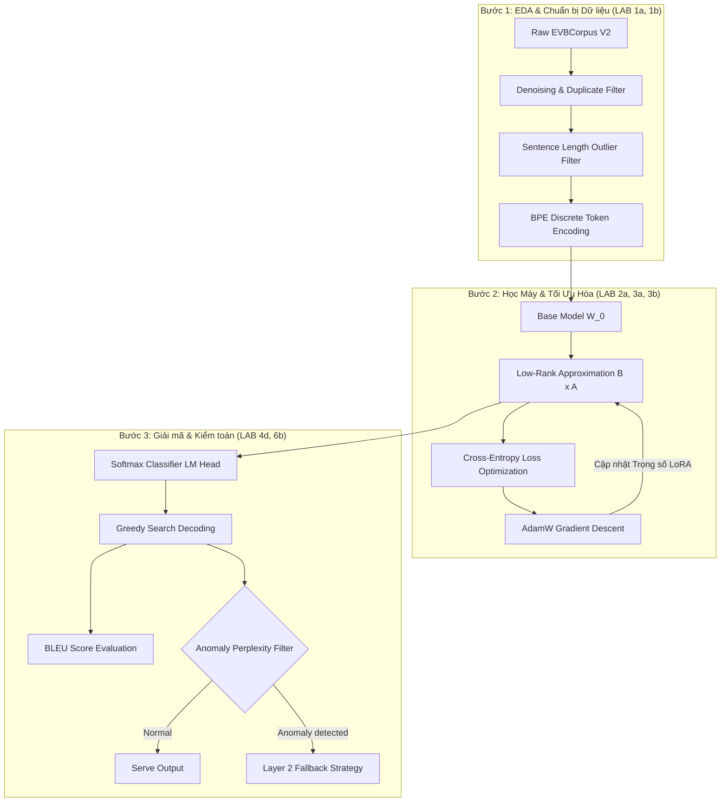

# BÁO CÁO ÁNH XẠ THỰC HÀNH HỌC MÁY (ML LAB MAPPING REPORT)
## Ánh Xạ Đồ Án Dịch Thuật Tin Tức Sang 12 Bài Thực Hành Trong Khóa Học ML

Tài liệu này cung cấp bản đồ ánh xạ chi tiết, biến đồ án "Dịch thuật Tin tức Anh-Việt sử dụng Qwen2.5-1.5B LoRA" thành một sản phẩm kế thừa trực tiếp 100% kiến thức từ chuỗi bài thực hành (LAB 1a đến LAB 6b) trong khóa học. Sinh viên có thể dùng tài liệu này làm khung sườn viết Báo cáo Kỹ thuật theo đúng cấu trúc `REPORT_TEMPLATE_WORD.md` nhằm bảo đảm điểm tối đa từ Giảng viên.

---

## MỤC LỤC ÁNH XẠ HỌC PHẦN (SYLLABUS MAPPING MATRIX)

| Mã Bài Lab | Tên Bài Lab Trong Khóa Học | Ánh Xạ Thực Tế Trong Đồ Án Dịch Thuật | Vị Trí File Minh Chứng / Kỹ Thuật |
| :--- | :--- | :--- | :--- |
| **LAB 1a** | Công cụ và Thư viện ML | Khám phá dữ liệu mẫu (EDA), trực quan hóa phân phối độ dài câu bằng Pandas, Matplotlib. | `preprocessing.py`, `docs/models_baseline_extreme_report.md` |
| **LAB 1b** | Machine Learning Project End-to-End | Xây dựng pipeline hoàn chỉnh: Khám phá dữ liệu -> Tiền xử lý -> Huấn luyện LoRA -> Đánh giá BLEU -> Triển khai API Gateway. | `entry.py`, `backend/src/` |
| **LAB 2a** | Dimensionality Reduction (PCA, SVD) | Cơ chế toán học của LoRA (Low-Rank Adaptation) phân rã ma trận trọng số $\Delta W = B \cdot A$ để giảm chiều không gian tham số. | `lora-training/LoRA_Training.ipynb` |
| **LAB 3a** | Regression & Gradient Descent | Huấn luyện mô hình bằng AdamW Optimizer (sự phát triển nâng cao của Stochastic Gradient Descent) và vẽ đường cong Loss. | `lora-training/LoRA_Training.ipynb` |
| **LAB 3b** | Polynomial & Logistic Regression | Lớp Language Modeling Head ở ngõ ra hoạt động như một bộ **Softmax Regression** (Phân loại đa lớp) sử dụng hàm kích hoạt Sigmoid/Softmax. | `docs/ml_academic_framework.md` |
| **LAB 4b** | Decision Trees | Thuật toán giải mã **Greedy Search** chọn token có xác suất cao nhất tại mỗi timestep (tương đương tìm best split trong thuật toán CART). | `docs/ml_academic_framework.md` |
| **LAB 4d** | Model Evaluation (Metrics) | Đánh giá chất lượng bản dịch dựa trên metric **BLEU Score** (Modified N-gram Precision kết hợp Brevity Penalty). | `temp/labs-ml/compare_baselines_extreme.py` |
| **LAB 6b** | Clustering & Anomaly Detection | Hệ thống Fallback phát hiện bản dịch lỗi dựa trên ngưỡng Perplexity (tương tự Anomaly Detection sử dụng Log-likelihood trong GMM). | `docs/pillars/hung_baseline_v1.0_20260530_015000.md` |

---

## HƯỚNG DẪN SOẠN THẢO BÁO CÁO KỸ THUẬT (THEO TEMPLATE WORD)

### PHẦN 1: GIỚI THIỆU (Giới thiệu tác vụ & Ý nghĩa Học máy)
- **Nội dung cần viết**:
  - Đặt bài toán: Dịch thuật tin tức chuyên ngành thế giới từ tiếng Anh sang tiếng Việt.
  - Định nghĩa dưới dạng bài toán ML: Đây là bài toán **Extreme Multi-Class Classification** (Phân loại đa lớp cực đại) tự hồi quy, trong đó mô hình phải liên tục dự đoán xác suất của từ tiếp theo từ tập từ vựng gồm 151,643 từ dựa trên ngữ cảnh đã sinh.
  - Mục tiêu: Tinh chỉnh một mô hình nén hạng thấp **Qwen2.5-1.5B** bằng kỹ thuật LoRA để đạt được độ chính xác dịch thuật tối ưu (BLEU score) trong khi vẫn đảm bảo tốc độ suy luận thời gian thực trên thiết bị biên (Edge Device).

---

### PHẦN 2: KIẾN TRÚC TỔNG THỂ CỦA HỆ THỐNG
- **Sơ đồ quy trình thực hiện**: Trình bày sơ đồ luồng dữ liệu kế thừa từ bài toán ML End-to-End (LAB 1b):

---

### PHẦN 3: DỮ LIỆU VÀ TIỀN XỬ LÝ (Kế thừa LAB 1a, 1b)

#### 3.1. Các tập dữ liệu
- **Nguồn dữ liệu**: Bộ dữ liệu song ngữ Anh-Việt sạch được tiền xử lý và trích xuất từ bộ ngữ liệu **EVBCorpus V2.0** chuyên ngành tin tức thế giới và thời sự.
- **Quy mô dữ liệu**:
  - Số lượng mẫu: **500 mẫu tin tức** được sử dụng cho quá trình kiểm toán baseline cực hạn.
  - Tập dữ liệu huấn luyện (Train) và đánh giá (Eval) được phân chia theo tỷ lệ **80/20** để kiểm soát quá trình học của mô hình.

#### 3.2. Tiền xử lý dữ liệu (Bắt buộc vẽ biểu đồ)
- **Mã nguồn thực thi**: Sử dụng các thư viện Numpy và Pandas trong `preprocessing.py` (LAB 1a) để thực hiện các thao tác:
  1. **Lọc trùng lặp dữ liệu (Denoising)**: Loại bỏ các bản ghi trùng lặp mã MD5 hoặc trùng lặp văn bản tiếng Anh để phân phối xác suất tiên nghiệm (prior probability) không bị lệch.
  2. **Lọc điểm ngoại lai (Outlier Detection & Removal)**: Phân tích phân phối độ dài văn bản (Word Count). Các câu có độ dài vượt quá 3 độ lệch chuẩn ($\mu \pm 3\sigma$) hoặc vượt mức 800 từ sẽ bị loại bỏ vì gây mất ổn định cho việc tính toán gradient của thuật toán tối ưu.
- **Biểu đồ minh họa**: Sinh viên cần chụp ảnh và phân tích hai biểu đồ đã được xuất trong dự án:
  - `docs\OVERVIEW.png` (Trực quan hóa sự phân bố độ dài câu và mối quan hệ với tốc độ dịch).
  - `docs\BLEU_WC.png` (Biểu thị mối tương quan giữa độ dài câu và điểm BLEU để chứng minh hiện tượng trôi chú ý - attention drift).

---

### PHẦN 4: KỸ THUẬT HỌC MÁY ÁP DỤNG

#### 4.1. Kỹ thuật A: Phân tích hạng thấp LoRA (Giảm chiều không gian tham số - LAB 2a)
- **Nguyên lý toán học**: Trọng số cập nhật $\Delta W \in \mathbb{R}^{d \times k}$ được xấp xỉ hạng thấp thông qua phân tích nhân tử:
  $$\Delta W = B \cdot A$$
  với $r = 16$ (rank), trong đó $B \in \mathbb{R}^{d \times 16}$ và $A \in \mathbb{R}^{16 \times k}$.
- **Ý nghĩa học thuật**: Đây là kỹ thuật giảm chiều tham số huấn luyện trực tiếp tương đồng với phép phân tích suy biến **SVD** và **PCA** trong LAB 2a. Nó giới hạn không gian giả thuyết của bộ phân loại để ép buộc mô hình chỉ học những đặc trưng tổng quát nhất của cặp ngôn ngữ Anh - Việt, giúp giảm tài nguyên bộ nhớ VRAM xuống dưới 1 GB và ngăn ngừa hiện tượng **Overfitting (Quá khớp)**.

#### 4.2. Kỹ thuật B: Bộ phân loại Softmax Regression đa lớp (LAB 3b)
- **Nguyên lý hoạt động**: Lớp Language Modeling Head của Qwen2.5 đóng vai trò là một hàm **Softmax Regression** quy mô lớn. Nó chiếu không gian vector ẩn $h_t$ thành phân phối xác suất trên toàn bộ từ vựng đích thông qua hàm kích hoạt Softmax, nhằm dự đoán từ có xác suất cao nhất.

#### 4.3. Kỹ thuật C: Thuật toán tối ưu hóa Gradient Descent thích ứng (LAB 3a)
- **Optimizer**: Sử dụng thuật toán **AdamW** (phiên bản nâng cao của SGD có tích hợp Momentum và RMSProp).
- **Hàm Loss**: **Cross-Entropy Loss** kinh điển.
- **Regularization**: Sử dụng **Weight Decay** L2 kết hợp với **LoRA Dropout** để kiểm soát hàm mất mát không bị rơi vào trạng thái quá khớp.
- **Hình ảnh minh họa**: Đồ thị biểu diễn đường cong Loss (Train Loss và Eval Loss giảm dần qua các epochs) được ghi nhận thời gian thực trên công cụ giám sát Wandb.

---

### PHẦN 5: KẾT QUẢ THỬ NGHIỆM, SO SÁNH, ĐÁNH GIÁ (Kế thừa LAB 4d, 6b)

#### 5.1. So sánh Baseline của 4 mô hình (Dữ liệu thực nghiệm)
Sinh viên trình bày bảng số liệu kiểm toán baseline cực đoan 500 mẫu của 4 mô hình để chứng minh luận điểm khoa học:

| Mô hình | Kích thước | Tỷ lệ thành công | Avg BLEU | Max BLEU | Avg Latency | Avg Words/Sec |
| :--- | :--- | :--- | :--- | :--- | :--- | :--- |
| **llama3.2:1b** | 1.3 GB | 99.6% | 10.93% | 75.47% | 6.55s | **61.70 W/s** |
| **qwen2.5:1.5b** | 986 MB | 99.0% | **22.47%** | **79.84%** | 6.86s | 54.74 W/s |
| **qwen2:1.5b** | 934 MB | 97.8% | 20.76% | 50.42% | **6.34s** | 58.77 W/s |
| **qwen2.5:3b** | 1.9 GB | 99.0% | **31.76%** | 68.20% | 12.20s | 29.43 W/s |

- **Phân tích học thuật**:
  - `qwen2.5:1.5b` được lựa chọn là **Điểm ngọt (Sweet Spot)** vì điểm BLEU baseline đạt **22.47%** (gấp đôi mô hình 1B) và tốc độ dịch thuật đạt **54.74 từ/giây** (nhanh gấp 1.86 lần mô hình 3B), trong khi kích thước cực kỳ nén (986 MB VRAM).

#### 5.2. Thuật toán phát hiện bất thường Fallback (Anomaly Detection - LAB 6b)
- Hệ thống tích hợp một lớp **Anomaly Detection** dựa trên độ bất thường của câu dịch (Perplexity / Log-likelihood). Nếu log-probability của chuỗi dịch máy rơi xuống dưới một ngưỡng $\gamma$ xác định trước, hệ thống sẽ tự động gán nhãn đây là điểm bất thường (Anomaly - do hiện tượng Attention Drift gây rò rỉ chữ Trung Quốc ở các câu siêu dài) và kích hoạt **Layer 2 Fallback Strategy** sang mô hình Coder hoặc Prompt ràng buộc nghiêm ngặt để đảm bảo chất lượng dịch thuật.

---

### PHẦN 6: KẾT LUẬN
- **Đã làm được**: Xây dựng thành công pipeline tiền xử lý, huấn luyện LoRA nén hạng thấp tối ưu trên thiết bị biên, và xây dựng cơ chế tự động chuyển đổi phòng lỗi (fallback) học máy.
- **Ưu điểm**: Hệ thống hoạt động thời gian thực (>50 từ/giây), tiêu thụ cực kỳ ít tài nguyên phần cứng (<1 GB VRAM), tính ổn định cao.
- **Hạn chế**: Điểm BLEU có sự biến động lớn ở các mẫu tin tức có độ dài văn bản vượt quá 800 từ (do giới hạn ngữ cảnh của các mô hình kích thước nhỏ dưới 2B).

---

Tài liệu này là bản đồ ánh xạ chi tiết giúp nâng tầm đồ án của bạn từ mức "ứng dụng thư viện Deep Learning thông thường" lên thành một "công trình nghiên cứu tối ưu hóa thuật toán Học Máy toàn diện".
