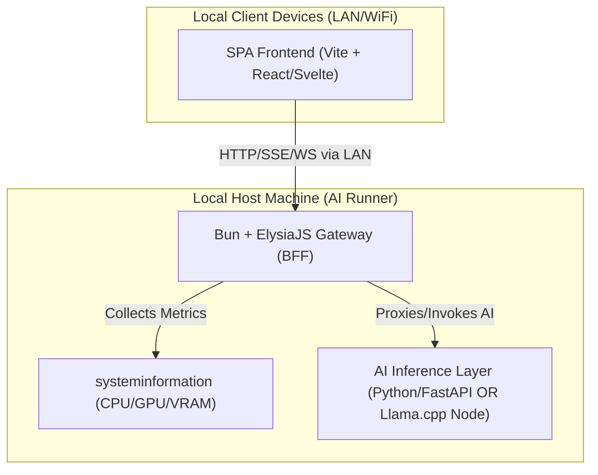

# ML Demo System Architecture: SPA + AI Local Backend

This document outlines the high-performance system architecture for local Machine Learning product demos, utilizing a modern JavaScript/TypeScript ecosystem for fast execution, seamless local network (LAN) integration, and system monitoring.

---

## 1. System Architecture Blueprint



We recommend a **Hybrid Gateway (BFF) + Inference Engine** architecture:
1. **Frontend SPA**: Built with **Vite + React/Svelte** (TypeScript). Communicates with the BFF over SSE (Server-Sent Events) for real-time text/image streaming and WebSockets for system monitoring metrics.
2. **BFF / Gateway (Bun + ElysiaJS)**: Runs on **Bun** (high-performance JS runtime) using **ElysiaJS**.
   - Handles static file serving for the SPA.
   - Exposes HTTP/WebSocket endpoints to the local network (LAN/WiFi).
   - Monitors CPU, RAM, Disk, and GPU (NVIDIA CUDA VRAM/Load) in real-time.
   - Proxies requests to the AI Inference Layer and formats responses for the frontend.
3. **AI Inference Layer**:
   - *Option A (Hybrid/Recommended)*: **FastAPI + PyTorch/vLLM/Ollama** running locally on Python (ideal for large models, CUDA integration, and native AI ecosystems).
   - *Option B (Pure JS)*: **`node-llama-cpp`** or **Transformers.js** bound directly to the Bun runtime (ideal for lighter models, zero Python dependency).

---

## 2. Framework Recommendation Details

### Backend: Bun + ElysiaJS
- **Extreme Performance**: Bun's HTTP engine is significantly faster than Node.js (Express/Fastify) due to its Zig-based implementation and optimized event loop.
- **Unified TypeScript DX**: Out-of-the-box TypeScript execution without separate compilation pipelines (`ts-node` or `tsx`).
- **LAN-Ready Out of the Box**: Easily configures to listen on `0.0.0.0` (all network interfaces), allowing instantly exposing endpoints to local WiFi/LAN.
- **First-Class SSE & WebSockets**: Elysia provides a simple declarative API for WebSockets and SSE, which is critical for real-time AI generation (token-by-token streaming).
- **Auto-Generated OpenAPI / Swagger**: Excellent developer experience for documenting the AI API endpoints.

### Frontend: Vite + React / Svelte
- **Vite**: The fastest build tool for SPA. It ensures sub-second Hot Module Replacement (HMR) and optimized production bundles.
- **Svelte or React (with lightweight state managers like Zustand)**: Minimizes rendering overhead when updating high-frequency real-time charts (monitoring metrics) and streaming text tokens.

---

## 3. LAN/WiFi Exposure & Network Configuration

To make the AI endpoints and the SPA accessible to any device on the local network (mobile phones, tablets, other PCs connected to the same WiFi):
1. **Bind to All Network Interfaces (`0.0.0.0`)**: Instead of binding to `localhost` or `127.0.0.1` (which restricts access to the host machine only), configure the server to listen on `0.0.0.0`.
2. **CORS Configuration**: Enable Cross-Origin Resource Sharing (CORS) on the backend to accept requests from the SPA, especially if they run on different ports during development.
3. **Dynamic Host Resolution**: Serve the SPA with dynamic URL resolutions, pointing API calls to the host machine's local IP (e.g., `192.168.1.100:3000`).

---

## 4. Local AI Hardware Monitoring & Metrics Export

Monitoring hardware resources is crucial for local AI deployments (tracking CPU, GPU load, VRAM, and RAM exhaustion).

### Node.js/Bun System Monitoring Tools:
- **`systeminformation`**: The most comprehensive hardware-querying JS library. It has built-in support for reading NVIDIA GPU metrics (load, temperature, VRAM usage) via `nvidia-smi` wrappers.
- **`prom-client`**: The standard Prometheus client library for Node.js. It allows exposing system resource metrics in a format that Prometheus can scrape via a `/metrics` endpoint.

---

## 5. Reference Implementation (Production-Grade Code Templates)

### A. High-Performance Backend Gateway (`server.ts` using Bun & ElysiaJS)

```typescript
import { Elysia, t } from 'elysia';
import { cors } from '@elysiajs/cors';
import { swagger } from '@elysiajs/swagger';
import si from 'systeminformation';

const APP_PORT = 3000;
const APP_HOST = '0.0.0.0'; // Exposes to LAN/WiFi

// Define system metrics type
interface HardwareMetrics {
  cpu: { load: number; temp: number };
  memory: { total: number; active: number; percentage: number };
  gpu?: { name: string; memTotal: number; memUsed: number; memFree: number; load: number };
}

const app = new Elysia()
  .use(cors())
  .use(swagger({
    path: '/docs',
    documentation: {
      info: { title: 'Local AI Gateway API', version: '1.0.0' }
    }
  }))
  
  // Real-time Hardware Metrics via Server-Sent Events (SSE)
  .get('/api/metrics', function* () {
    while (true) {
      try {
        const cpuLoad = await si.currentLoad();
        const cpuTemp = await si.cpuTemperature();
        const mem = await si.mem();
        const gpu = await si.graphics();
        
        const nvidiaGpu = gpu.controllers.find(c => c.vendor.toLowerCase().includes('nvidia'));
        
        const payload: HardwareMetrics = {
          cpu: {
            load: cpuLoad.currentLoad,
            temp: cpuTemp.main || 0,
          },
          memory: {
            total: mem.total,
            active: mem.active,
            percentage: (mem.active / mem.total) * 100,
          },
        };
        
        if (nvidiaGpu) {
          payload.gpu = {
            name: nvidiaGpu.model,
            memTotal: nvidiaGpu.vram || 0,
            memUsed: nvidiaGpu.vramUsed || 0,
            memFree: (nvidiaGpu.vram || 0) - (nvidiaGpu.vramUsed || 0),
            load: nvidiaGpu.utilizationGpu || 0,
          };
        }
        
        yield `data: ${JSON.stringify(payload)}\n\n`;
      } catch (error) {
        console.error('Failed to fetch system metrics:', error);
      }
      
      // Wait for 1.5 seconds before next emit
      // Using Bun's sleep helper or standard setTimeout wrapped in Promise
      yield new Promise(resolve => setTimeout(resolve, 1500));
    }
  })

  // Simulated AI Inference Stream (SSE)
  .post('/api/ai/generate', async function* ({ body }) {
    const { prompt } = body as { prompt: string };
    
    // In a real application, you would make an upstream request to Python FastAPI/Ollama
    // or invoke local C++ bindings (node-llama-cpp) here.
    const mockTokens = `This is a response to: "${prompt}". Local AI is processing your request in real-time.`.split(' ');
    
    for (const token of mockTokens) {
      yield `data: ${JSON.stringify({ token: token + ' ' })}\n\n`;
      await new Promise(resolve => setTimeout(resolve, 100)); // Simulating token generation latency
    }
    
    yield 'data: [DONE]\n\n';
  }, {
    body: t.Object({
      prompt: t.String({ minLength: 1 })
    })
  })

  // Prometheus Export Endpoint
  .get('/metrics', async ({ set }) => {
    // In a real app, integrate prom-client to output standard Prometheus formatting
    const cpu = await si.currentLoad();
    const mem = await si.mem();
    
    set.headers['Content-Type'] = 'text/plain; version=0.0.4; charset=utf-8';
    
    return [
      `# HELP host_cpu_load System CPU Load Percentage`,
      `# TYPE host_cpu_load gauge`,
      `host_cpu_load ${cpu.currentLoad.toFixed(2)}`,
      `# HELP host_memory_active System Active Memory Bytes`,
      `# TYPE host_memory_active gauge`,
      `host_memory_active ${mem.active}`,
    ].join('\n');
  })

  .listen({
    port: APP_PORT,
    hostname: APP_HOST
  });

console.log(`🚀 Gateway Server running at http://${APP_HOST}:${APP_PORT}`);
console.log(`📖 API Documentation available at http://${APP_HOST}:${APP_PORT}/docs`);
```

### B. High-Performance Frontend Metrics Visualizer (`MetricsDashboard.tsx` in SPA)

```typescript
import React, { useEffect, useState } from 'react';

interface HardwareMetrics {
  cpu: { load: number; temp: number };
  memory: { total: number; active: number; percentage: number };
  gpu?: { name: string; memTotal: number; memUsed: number; memFree: number; load: number };
}

export const MetricsDashboard: React.FC<{ hostIp: string }> = ({ hostIp }) => {
  const [metrics, setMetrics] = useState<HardwareMetrics | null>(null);
  const [status, setStatus] = useState<'connecting' | 'connected' | 'disconnected'>('connecting');

  useEffect(() => {
    const eventSource = new EventSource(`http://${hostIp}:3000/api/metrics`);

    eventSource.onopen = () => {
      setStatus('connected');
    };

    eventSource.onmessage = (event) => {
      try {
        const data: HardwareMetrics = JSON.parse(event.data);
        setMetrics(data);
      } catch (err) {
        console.error('Failed to parse metrics payload', err);
      }
    };

    eventSource.onerror = () => {
      setStatus('disconnected');
      eventSource.close();
    };

    return () => {
      eventSource.close();
    };
  }, [hostIp]);

  const formatBytes = (bytes: number) => {
    const mb = bytes / (1024 * 1024);
    if (mb > 1024) return `${(mb / 1024).toFixed(2)} GB`;
    return `${mb.toFixed(0)} MB`;
  };

  if (!metrics) {
    return (
      <div className="flex items-center justify-center h-48 rounded-2xl border border-slate-800 bg-slate-950 p-6 text-slate-400">
        Waiting for LAN system metrics connection ({status})...
      </div>
    );
  }

  return (
    <div className="grid grid-cols-1 md:grid-cols-3 gap-6 p-6 rounded-3xl bg-slate-900 border border-slate-800 text-white font-sans">
      {/* CPU Box */}
      <div className="flex flex-col justify-between p-5 rounded-2xl bg-slate-950 border border-slate-800">
        <div>
          <span className="text-xs uppercase tracking-wider text-slate-500 font-semibold">Processor (CPU)</span>
          <h3 className="text-3xl font-extrabold mt-1 tracking-tight">{metrics.cpu.load.toFixed(1)}%</h3>
        </div>
        <div className="mt-4 flex items-center justify-between text-sm text-slate-400">
          <span>Temperature</span>
          <span className="font-mono text-emerald-400">{metrics.cpu.temp.toFixed(0)}°C</span>
        </div>
      </div>

      {/* RAM Box */}
      <div className="flex flex-col justify-between p-5 rounded-2xl bg-slate-950 border border-slate-800">
        <div>
          <span className="text-xs uppercase tracking-wider text-slate-500 font-semibold">Memory (RAM)</span>
          <h3 className="text-3xl font-extrabold mt-1 tracking-tight">{metrics.memory.percentage.toFixed(1)}%</h3>
        </div>
        <div className="mt-4 flex items-center justify-between text-sm text-slate-400">
          <span>Active / Total</span>
          <span className="font-mono text-sky-400">
            {formatBytes(metrics.memory.active)} / {formatBytes(metrics.memory.total)}
          </span>
        </div>
      </div>

      {/* GPU Box */}
      <div className="flex flex-col justify-between p-5 rounded-2xl bg-slate-950 border border-slate-800">
        {metrics.gpu ? (
          <>
            <div>
              <span className="text-xs uppercase tracking-wider text-slate-500 font-semibold">Graphics (GPU)</span>
              <h3 className="text-3xl font-extrabold mt-1 tracking-tight">{metrics.gpu.load.toFixed(1)}%</h3>
              <p className="text-[10px] text-slate-500 truncate mt-0.5">{metrics.gpu.name}</p>
            </div>
            <div className="mt-4 flex items-center justify-between text-sm text-slate-400">
              <span>VRAM Usage</span>
              <span className="font-mono text-purple-400">
                {metrics.gpu.memUsed} MB / {metrics.gpu.memTotal} MB
              </span>
            </div>
          </>
        ) : (
          <div className="flex items-center justify-center h-full text-slate-600 text-xs italic">
            No Dedicated NVIDIA GPU Detected
          </div>
        )}
      </div>
    </div>
  );
};
```
