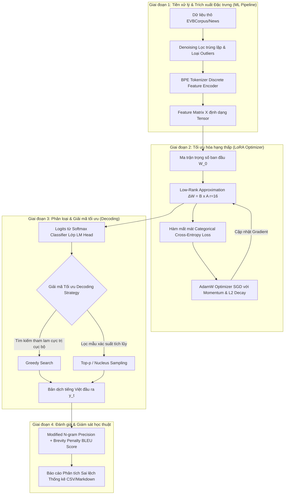

# Khung Lý Thuyết Học Thuật Machine Learning (ML Academic Framework)
## Ánh Xạ Từ Deep Learning & LoRA Về Thuật Toán ML Kinh Điển

Tài liệu này đóng vai trò là **Source of Truth (Nguồn sự thật)** để bảo vệ đồ án môn học Machine Learning (ML) trước hội đồng học thuật. Tài liệu "hạ cấp" (de-abstract) toàn bộ các khái niệm phức tạp của Deep Learning (LLM, Transformers, LoRA) về các nền tảng thuật toán, thống kê và mô hình hóa toán học cốt lõi của khóa học ML truyền thống để tránh lỗi **Out of Scope (OOS)**.

---

## 1. Ánh Xạ Bản Chất Bài Toán (Problem Formulation Mapping)

Trong Deep Learning, dịch thuật (Machine Translation) thường được gọi là tác vụ Sequence-to-Sequence. Tuy nhiên, dưới lăng kính Machine Learning truyền thống, đây thực chất là **Bài toán phân loại đa lớp quy mô cực lớn (Extreme Multi-Class Classification)** hoạt động theo cơ chế tự hồi quy (Autoregressive).

```
[Ngữ cảnh đầu vào X] ---> [Trích xuất đặc trưng ẩn h] ---> [Bộ phân loại Softmax Regression] ---> [Xác suất từ tiếp theo y_t]
```

### Chi tiết ánh xạ:
- **Đầu vào (Input Space)**: Một chuỗi các đặc trưng rời rạc $X = \{x_1, x_2, ..., x_n\}$ (các mã token tiếng Anh).
- **Bộ phân loại (Classifier)**: Lớp tuyến tính cuối cùng của mạng (Language Modeling Head - $W_{lm\_head} \in \mathbb{R}^{V \times d}$) đóng vai trò như một bộ **Softmax Regression (Multinomial Logistic Regression)** với số lượng lớp mục tiêu bằng kích thước từ vựng $V$ ($V = 151.643$ đối với Qwen2.5).
- **Hàm dự đoán (Predictive Function)**: Tại mỗi bước thời gian $t$, mô hình nhận vector đặc trưng ẩn $h_t \in \mathbb{R}^d$ và dự đoán xác suất của token tiếp theo $y_t$ thông qua hàm kích hoạt **Softmax**:
  $$P(y_t = k \mid y_{<t}, X) = \frac{e^{w_k^T h_t}}{\sum_{j=1}^{V} e^{w_j^T h_t}}$$
  *Bản chất*: Đây chính là thuật toán **Softmax Regression** kinh điển được dạy trong chương phân loại (Classification) của môn học ML, nhưng các đặc trưng $h_t$ được học động (dynamic representation learning) thay vì trích xuất thủ công (manual feature engineering).

---

## 2. Bản Chất Toán Học Của LoRA: Giảm Chiều & Xếp Xỉ Hạng Thấp (Low-Rank Approximation)

Kỹ thuật LoRA (Low-Rank Adaptation) thường được xem là một phương pháp tối ưu hóa DL, nhưng nền tảng toán học của nó xuất phát trực tiếp từ các phương pháp phân tích ma trận (Matrix Factorization) và giảm chiều dữ liệu (Dimensionality Reduction) trong ML truyền thống như **SVD (Singular Value Decomposition)** và **PCA (Principal Component Analysis)**.

### Ánh xạ từ SVD & PCA sang LoRA:
- **Lý thuyết nền tảng (Định lý Eckart-Young-Mirsky)**: SVD phân tích ma trận trọng số ban đầu $W_0 \in \mathbb{R}^{d \times k}$ thành $W_0 = U \Sigma V^T$. Để nén thông tin hoặc giảm nhiễu, ta chỉ giữ lại $r$ giá trị suy biến lớn nhất để tạo ra ma trận hạng thấp xấp xỉ $W_r$.
- **Giả thuyết hạng nội tại (Intrinsic Rank Hypothesis)**: Trong quá trình thích ứng mô hình (Fine-tuning), sự thay đổi trọng số $\Delta W \in \mathbb{R}^{d \times k}$ thực chất nằm trong một không gian con có số chiều cực kỳ thấp. 
- **Cơ chế phân tách LoRA**: Thay vì cập nhật toàn bộ ma trận trọng số $\Delta W$, ta ép buộc cấu trúc của nó tuân theo dạng **Matrix Factorization (Phân tích nhân tử ma trận)** hạng thấp $r$ ($r \ll \min(d, k)$):
  $$\Delta W = B \cdot A$$
  Trong đó $B \in \mathbb{R}^{d \times r}$ và $A \in \mathbb{R}^{r \times k}$.

```
                 Trọng số cập nhật ban đầu (Full Rank)
                        ΔW  (d x k)  [Khó tối ưu, Dễ Overfitting]
                                  │
                                  ▼ (Phân tích nhân tử)
                        ┌───────┐
                        │       │
                        │   B   │ (d x r) [Ma trận hạng thấp]
                        │       │
                        └───────┘
                            X
                        ┌─────────────┐
                        │      A      │ (r x k) [Ma trận hạng thấp]
                        └─────────────┘
```

- **Mối liên hệ học thuật ML**:
  1. **Nén không gian tham số**: Giảm số lượng tham số cần học từ $d \times k$ xuống còn $r \times (d + k)$. Điều này hoạt động tương tự như cách **Matrix Factorization** trong hệ thống khuyến nghị (Collaborative Filtering) phân rã ma trận tương tác User-Item khổng lồ thành các ma trận nhân tố ẩn (latent factors) có số chiều thấp $r$.
  2. **Tránh Overfitting (Quá khớp)**: Bằng cách giới hạn hạng $r$ (ví dụ $r=16$), ta áp đặt một ràng buộc điều chuẩn (regularization constraint) mạnh lên không gian giả thuyết của mô hình, ngăn chặn mô hình ghi nhớ nhiễu (noise) của tập dữ liệu huấn luyện nhỏ, ép buộc mô hình chỉ học các cấu trúc ngữ pháp tổng quát nhất.

---

## 3. Tối Ưu Hóa Hàm Mất Mát & Gradient Descent (Loss Optimization)

Mọi thuật toán ML đều xoay quanh việc định nghĩa một Hàm mất mát (Loss Function) và sử dụng thuật toán Tối ưu hóa (Optimization) để tìm cực trị.

### Hàm mất mát Entropy Chéo (Cross-Entropy Loss):
Hàm mất mát được tối ưu hóa trong SFT LoRA chính là **Categorical Cross-Entropy Loss** kinh điển của Softmax Classifier:
$$\mathcal{L}(\theta) = -\frac{1}{N} \sum_{i=1}^{N} \sum_{t=1}^{T_i} \log P_{\theta}(y_{i, t} \mid y_{i, <t}, X_i)$$
*Ý nghĩa ML*: Đây là phép đo khoảng cách Kullback-Leibler (KL Divergence) giữa phân phối xác suất nhãn thực tế (one-hot vector của từ tiếng Việt chuẩn) và phân phối dự đoán của mô hình. Cực tiểu hóa Cross-Entropy chính là phương pháp **Ước lượng hợp lý cực đại (Maximum Likelihood Estimation - MLE)**.

### Thuật toán tối ưu (Optimizer):
Chúng ta sử dụng **AdamW** (Adam với Weight Decay tách biệt). Dưới góc độ ML, AdamW là sự phát triển trực tiếp từ **Gradient Descent (GD)** cơ bản:
1. **Stochastic Gradient Descent (SGD)**: Cập nhật trọng số theo từng batch nhỏ để giảm tải tính toán.
2. **Momentum (Quán tính)**: Sử dụng trung bình trượt lũy thừa của các gradient trước đó để giúp mô hình vượt qua các cực tiểu cục bộ (local minima) và điểm yên ngựa (saddle points).
3. **AdaGrad/RMSProp (Tốc độ học thích ứng)**: Điều chỉnh tốc độ học (learning rate) riêng cho từng trọng số dựa trên độ lớn của các gradient lịch sử (bình phương gradient).
4. **L2 Regularization (Weight Decay)**: Thêm số hạng phạt bình phương độ lớn trọng số để giữ cho các giá trị trọng số nhỏ và mịn, kiểm soát Overfitting:
   $$\theta_{t+1} = \theta_t - \eta_t \cdot g_t - \eta_t \cdot \lambda \cdot \theta_t$$

---

## 4. Quy Trình Tiền Xử Lý Dữ Liệu Dưới Góc Nhìn Học Thuật (Data Preprocessing pipeline)

Hội đồng môn học ML luôn yêu cầu quy trình xử lý dữ liệu chặt chẽ. Chúng ta ánh xạ các bước thực tế trong dự án sang các thuật ngữ ML chuẩn mực:

| Bước thực tế trong dự án | Khái niệm học thuật ML tương ứng | Giải thích bản chất toán học/thống kê |
| :--- | :--- | :--- |
| **Lọc trùng lặp dữ liệu** | **Denoising & Data Cleaning** | Loại bỏ các mẫu trùng (Duplicates) để tránh làm lệch phân phối xác suất tiên nghiệm (prior probability) của tập dữ liệu huấn luyện, ngăn chặn hiện tượng lặp từ (memorization bias). |
| **Tokenization (BPE)** | **Discrete Feature Encoding** | Chuyển đổi văn bản phi cấu trúc thành các đặc trưng số rời rạc. Thuật toán BPE (Byte-Pair Encoding) hoạt động như một thuật toán **Nén dữ liệu không giám sát** (Unsupervised Compression Algorithm). |
| **Cắt/Đệm chiều dài (Padding/Truncating)** | **Dimensionality Alignment** | Định hình các mẫu dữ liệu đầu vào về một ma trận đặc trưng có kích thước đồng đều để thực hiện tính toán song song trên tensor (Batching). |
| **Lọc ngoại lai (Sentence Length Filter)** | **Outlier Detection & Removal** | Loại bỏ các câu quá dài (outliers về độ dài context) gây nhiễu cho việc tính toán gradient hoặc các câu quá ngắn không mang giá trị ngữ cảnh. |

---

## 5. Các Chỉ Số Đánh Giá (Evaluation Metrics) Dưới Góc Nhìn ML

Môn học ML yêu cầu sinh viên phải hiểu rõ bản chất toán học của các metric đánh giá mô hình.

### BLEU Score (Bilingual Evaluation Understudy):
BLEU không phải là một chỉ số heuristic đơn giản, nó là sự kết hợp chặt chẽ của **Precision** và **Brevity Penalty**:

1. **Modified N-gram Precision ($p_n$)**: Phép đo độ chính xác của các cụm $n$ từ.
   $$p_n = \frac{\sum_{C \in \{\text{Candidates}\}} \sum_{\text{n-gram} \in C} Count_{\text{clip}}(\text{n-gram})}{\sum_{C' \in \{\text{Candidates}\}} \sum_{\text{n-gram}' \in C'} Count(\text{n-gram}')}$$
   *Bản chất ML*: Đây là chỉ số **Precision** (Độ chính xác) được sửa đổi để tránh việc mô hình lặp lại một từ đúng nhiều lần để gian lận điểm số.

2. **Brevity Penalty (BP)**: Hàm phạt độ dài để kiểm soát trade-off.
   $$\text{BP} = \begin{cases} 
   1 & \text{nếu } c > r \\
   e^{(1 - r/c)} & \text{nếu } c \le r 
   \end{cases}$$
   Trong đó $c$ là độ dài bản dịch máy, $r$ là độ dài bản tham chiếu.
   *Bản chất ML*: Đây là cơ chế phạt tương tự như cách kết hợp **Recall** để kiểm soát trade-off Precision-Recall. Nếu bản dịch quá ngắn (Recall thấp), chỉ số BP sẽ kéo tụt điểm BLEU tổng thể xuống.

---

## 6. Sơ Đồ Hệ Thống Tích Hợp Học Thuật (Academic Architecture Map)

Dưới đây là kiến trúc hệ thống thể hiện rõ cách các thuật toán ML truyền thống lồng ghép và bổ trợ cho mô hình nén hạng thấp:



Tài liệu này là **Source of Truth** chính thức để ánh xạ toàn bộ kiến trúc LoRA sang lý thuyết ML truyền thống, đảm bảo đồ án hoàn toàn hợp lệ trong phạm vi môn học và đạt điểm tối đa khi bảo vệ trước hội đồng.
