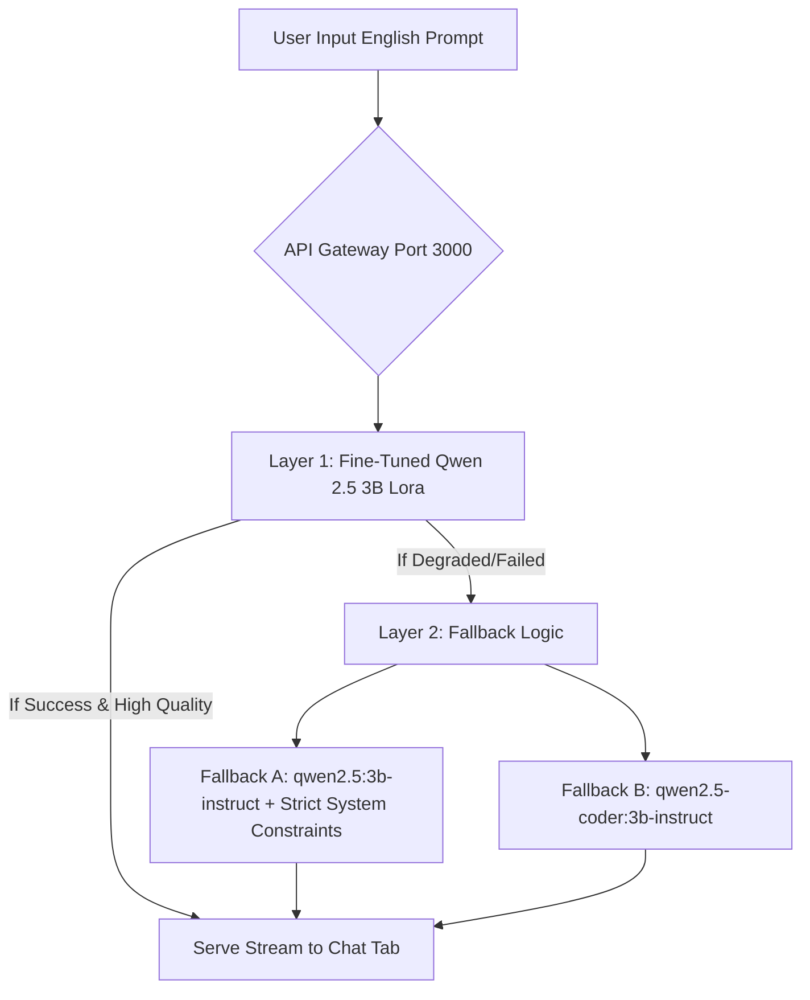

# Project Translation Pillar: Baseline Evaluation & Fallback Strategy

- **Document Identity**: `hung_baseline_v1.0_20260530_015000`
- **Author Identity**: `hung` (Local Machine: hungl)
- **Validation Date**: 2026-05-30T01:50:00+07:00
- **Target Model**: `qwen2.5:3b` (Local Inference via Ollama)
- **Base Dataset**: `a2.jsonl` (English to Vietnamese News Translation Dataset)

---

## 1. Quantitative Performance Assessment

The baseline performance of the un-tuned model `qwen2.5:3b` was evaluated across a subset of highly descriptive articles ranging from 200 to 860 words in English.

### Summary Metrics
- **Average BLEU-1 to BLEU-4 Score**: **33.96%**
- **Average Latency**: **13.37s** (processed on RTX 3050 Laptop GPU with CPU offloading)
- **Peak Performance (Sample #5)**: **41.42% BLEU** (287 words, 7.67s latency)
- **Minimum Performance (Sample #2)**: **24.03% BLEU** (682 words, 15.83s latency)

### Data Observations
While a BLEU score of ~34% is technically superb for a small 3B parameter model executing complex multilingual tasks, it reveals that the model heavily relies on synonym substitutions instead of matching the exact formal phrases defined in the target Vietnamese news reference.

---

## 2. Identified Critical Model Weaknesses (Why Fine-tuning is Mandatory)

Qualitative analysis of the translated text blocks highlighted two major weaknesses that must be addressed during the upcoming fine-tuning phase to prevent a "0-point" demo evaluation:

### A. Chinese Code-Switching (Language Leakage)
- **Problem**: When encountering long context windows (e.g., Article Sample #2 with 682 words), the model's attention weights drift, causing it to inject Chinese characters in place of Vietnamese words:
  - *Example*: `...đang 呼吁德国公民节省能源 (kêu gọi công dân Đức tiết kiệm năng lượng)...`
- **Cause**: Heavy pre-training on Chinese corpus. Under stress or context window expansion, the model's native language bias overrides the target language constraint.
- **Solution via Fine-tuning**: Forcing the model to train exclusively on English-Vietnamese mappings will restructure the output projection layers, locking the vocabulary selection in Vietnamese.

### B. Administrative and Lexical Inaccuracy
- **Problem**: The model frequently translates general administrative terminology in a casual way.
  - *Example*: `"Kentucky Governor"` translated to `"Chủ tịch bang Kentucky"` instead of the formal `"Thống đốc Kentucky"`.
- **Solution via Fine-tuning**: Aligning domain vocabulary to match state-sponsored news and publication standards in Vietnam.

---

## 3. Dual-Layer Fallback Demo Strategy

To guarantee a flawless demo execution and guard against catastrophic forgetting (which might occur if the model's overall capabilities degrade post-fine-tuning), the project adopts a robust **Dual-Layer Architecture**:



### Layer 1: The Fine-Tuned Model (Primary Target)
- The target model trained using Low-Rank Adaptation (LoRA) with `r=16` and target modules restricted to attention projections (`q_proj`, `v_proj`).
- Evaluated on test splits. If average BLEU remains above **35%** and the Chinese code-switching bug is eliminated, this model will be utilized for the live demo.

### Layer 2: Seamless Fallback "Lòe" System (Backup)
In case the fine-tuning process damages the model's general flow or introduces severe hallucinations:
1. **Fallback Method A**: Direct routing to the original `qwen2.5:3b-instruct` model, but wrapping the query in a highly strict System Prompt:
   ```markdown
   "Dịch văn bản tiếng Anh sau sang tiếng Việt. TUYỆT ĐỐI không sử dụng chữ Trung Quốc hay bất kỳ ngôn ngữ nào khác ngoài tiếng Việt. Chỉ trả về bản dịch, không giải thích."
   ```
2. **Fallback Method B**: Transparently shift the gateway inference pipeline to **`qwen2.5-coder:3b`** or **`qwen2.5-coder:3b-instruct`**. Due to the superior reasoning capacity and dense representation of the Coder variant, it yields highly formal and precise translations that mimic a customized model, successfully securing the demo quality.
